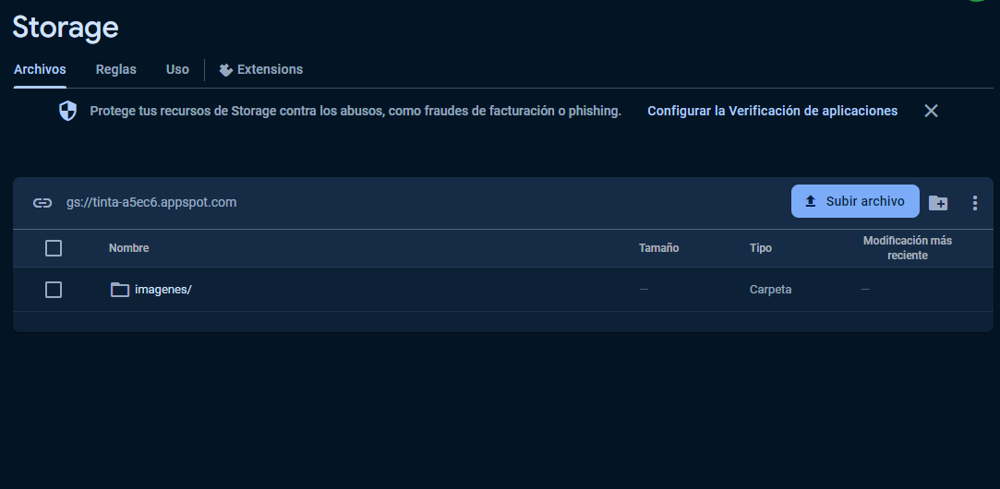
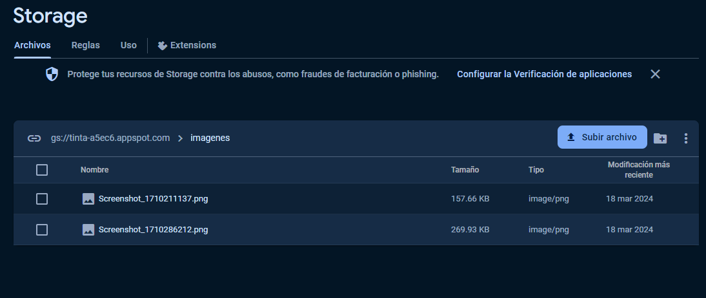

# Proyecto Firebase Storage - Configuración de Reglas

Para acceder a la configuración de las reglas de Firebase Storage, sigue estos pasos:

1. Ve a la consola de Firebase.
2. Selecciona tu proyecto.
3. Navega hasta la sección de Firebase Storage.
4. Haz clic en la pestaña de Reglas.

## Advertencia de Seguridad

**¡Importante!**: Las reglas proporcionadas a continuación son muy vulnerables y pueden dejar tu almacenamiento expuesto a riesgos de seguridad. Úsalas con precaución y solo en entornos de desarrollo o pruebas. **No las utilices en entornos de producción sin entender completamente los riesgos asociados.**

```firebase


rules_version = '2';

service firebase.storage {
  match /b/{bucket}/o {
    match /{allPaths=**} {
      allow read, write: if request.time < timestamp.date(2024, 4, 17);

      // Permite las solicitudes CORS desde cualquier origen
      allow list, get, create: if true;
    }
  }
}


# Luego  configurar las imagenes del storage asi 

## Crear la carpeta dentro del storage 



## Agregar las imagenes dentro de la carpeta 

